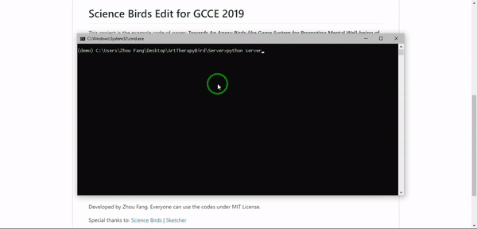

# Science Birds Edit for GCCE 2019

Last updated: Oct 16th, 2019

This project is the example code of paper: __Towards An Angry Birds-like Game System for Promoting Mental Well-being of Players Using Art-Therapy-embedded PCG__

# How to use
1. Create a Python 3.7 enviroment with the following packages: 
    - `flask`: Web app framework
    - `pillow`: Image processing
    - `lxml`: Read and write the level file.
    - `requests`: Use optional online API to generate sentences.
2. __Optional__ Create a account on [https://dictionaryapi.com/](https://dictionaryapi.com/). And copy the free api key to `Server/simple_doctor.py`.
3. Start server to handle data. Server will read `Webapp` directory as root directory, you also can configure the path inside `Server/server.py`.  __Linux build is not tested.__
4. Download [Unity Hub](https://unity3d.com/get-unity/download), install the latest 2018 LTS version.
5. Compile the game, create a `Client` directory in git directory.
    - Windows: Save the game and related files in `Client` directory.
    - macOS: Save the game in `Client` directory.
6. each time user click the `Next` button in webapp, `Level 4` will be redesigned.

# Copyright
Developed by Zhou Fang.
Everyone can use the codes under MIT License.

Special thanks to: 
[Science Birds](https://github.com/lucasnfe/Science-Birds)